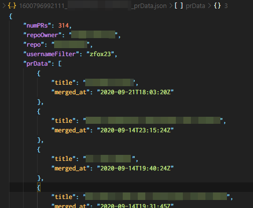

# GitHub Info Grabber
This application provides users with a simple way to download various pieces of information about a GitHub repository.

This is useful to me because I like to keep track of my accomplishments at work, and one high-level way to do that is to look at the titles of the PRs that I've merged.

Right now, this application will retrieve, format, and write to disk the following information from a specified repository:
- Pull request data:
    - Titles
    - Merged time

Here's an example of what the output file looks like:

# How do I use this?
1. Clone this repository to your local disk, or download the latest version of the `main` branch code [here](https://github.com/zfox23/githubInfoGrabber/archive/main.zip).
2. Ensure NodeJS v12.18.x is installed: [https://nodejs.org/en/](https://nodejs.org/en/)
3. Rename `requestData.json.example` to `requestData.json`.
4. Modify the values for all keys inside `requestData.json` to fit your needs:
    1. Replace the value of `GITHUB_ACCESS_TOKEN` with your GitHub Access Token. [Click here to get a GitHub Access Token.](https://github.com/settings/tokens/new?scopes=repo)
    2. Replace the value of `owner` with the owner of the repository about which you want to retrieve data.
    3. Replace the value of `repo` with the name of the repository about which you want to retrieve data.
    4. You can leave the value of `usernameFilter` blank, unless you want to filter results such that they pertain only to this user.
5. Open a PowerShell/Command Prompt/Terminal window, then `cd` into the directory containing this repository.
6. Run `npm i` to install this project's dependencies.

## Now you're ready to run the script!
Run `node index.js`. Script output will be placed inside the `./output/` folder.